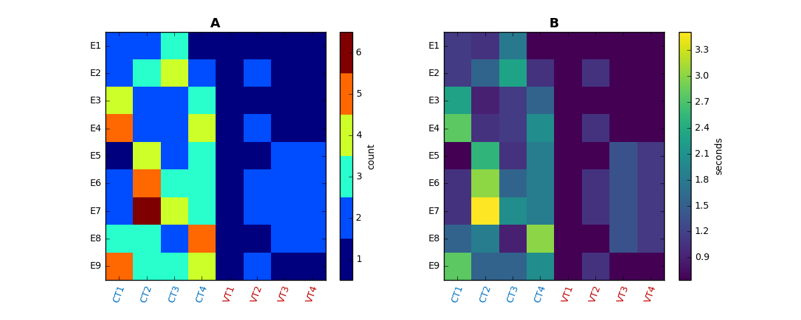

========
aglcheck
========

.. contents::

What is aglcheck?
-----------------
aglcheck is a python library for analyzing similarity between strings used in
artificial grammar learning (AGL) experiments.

aglcheck was initially written to analyze string sets for unintentional
confounds based on acoustic similarity in a sample of 9 AGL studies in nonhuman
 animals for the scientific paper:

Beckers, G.J.L., Berwick B.C., Okanoya, K. and Bolhuis, J.J. (2016) What do
animals learn in artificial grammar studies? Neuroscience & Biobehavioral
Reviews [http://dx.doi.org/10.1016/j.neubiorev.2016.12.021])

However the wider objective is to provide visualization software that can be
used to analyze AGL string set design in general.

An example of a visualization that shows a bias in shared chunk length and
corresponding duration is ('E' strings are exposure strings, 'CT' grammar
correct test strings, and 'VT' grammar violating test strings):

Quantifications and visualizations can be produced from a simple text file
(yaml), that lists the strings of interest, and, optionally, provides token
durations (see example_)
    .. _example: aglcheck/datafiles/wilsonetal_natcomm_2015.yaml

More details on matches at the level of individual strings can be scrutinized
in generated HTML tables (see example_)
    .. _example: example_figures/example_table.html

Development status
------------------
This is alpha software. It works for what it was initially was designed for,
but is also usable for wider application. The lack of documentation is the
biggest hurdle, but see below. Contributions in any form are very welcome.

The 0.1.x series is intended to remain compatible with the the jupyter
notebook that produces the supplementary information. The 0.2.x series should
be refactored so that functions and classes are more logically named and
organized for general use.

Documentation
-------------
There is no documentation yet, but for now hopefully the jupyter notebooks in
the tutorials folder show the library can be used.

Copyright and License
---------------------

:copyright: Copyright 2016 by Gabriel Beckers, Utrecht University.
:license: 3-Clause Revised BSD License, see LICENSE.txt for details.

Contact
-------
Gabriel Beckers, Utrecht University, https://www.gbeckers.nl